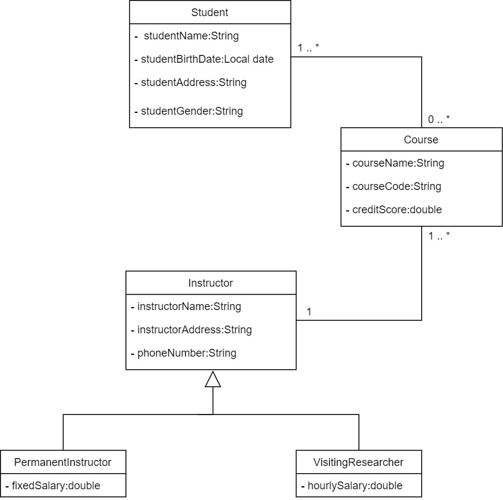

# Description

---
- The first project of Gitti Gidiyor Java Spring Bootcamp by patika.
- Mysql database design of a sample school management system.
- The project's mysql connection was provided using Hibernate.

# UML diagram of school management system

---

# First Project

